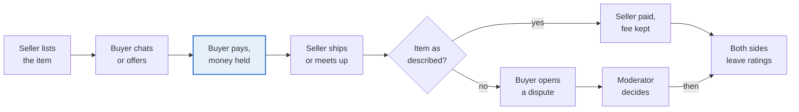
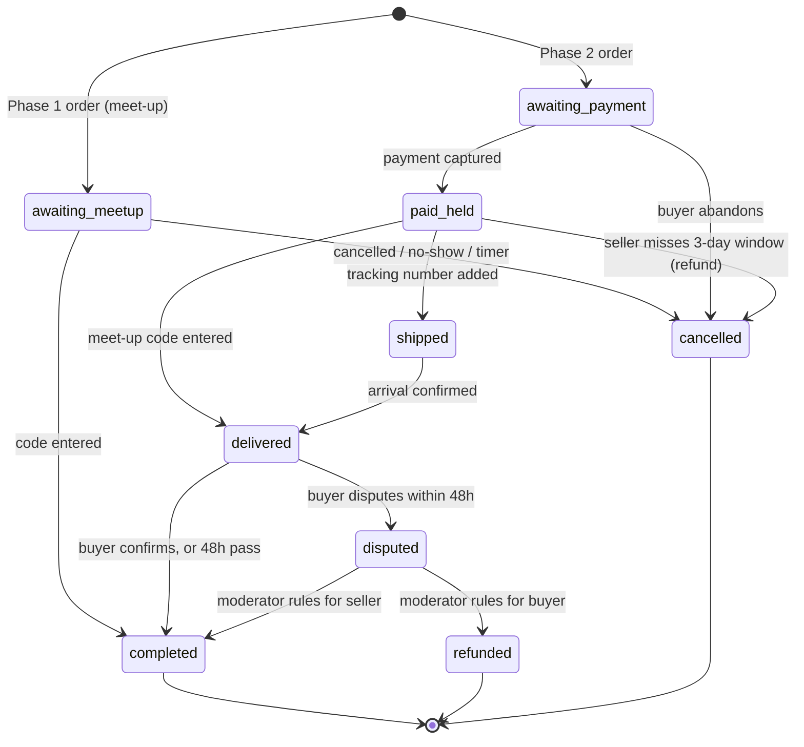
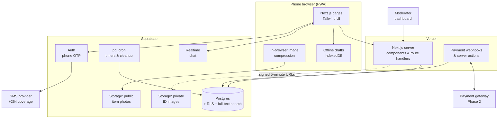
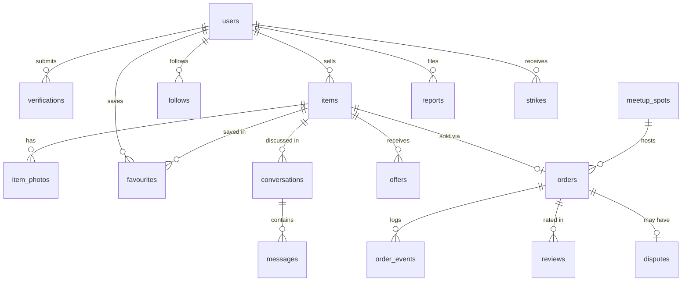
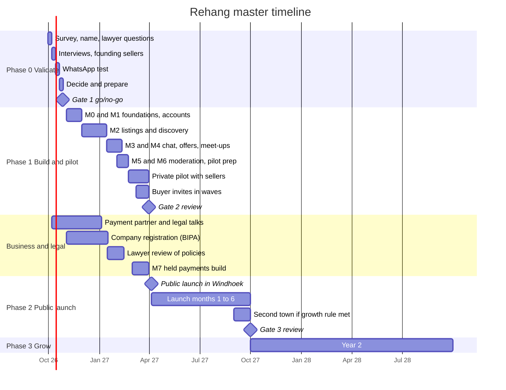
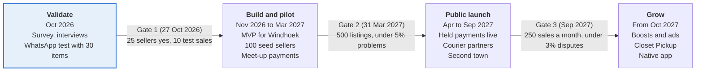

# Rehang

> **Clear your closet. Earn from it.** · *Hang it again.*

Rehang is a mobile-first marketplace where Namibians list clothes from their closets, verified buyers pay safely, and both sides are protected. It starts in Windhoek and grows town by town.

The name comes from the hanger: a garment is "hung again" and gets a second life with someone new.

| | |
|---|---|
| **Status** | Phase 0: Validate (no code yet) |
| **Plan version** | v2, 29 September 2026 (v1 was the original PDF plan. See [changes](#21-changes-from-the-original-plan)) |
| **Owner** | Phellep Shapopi |
| **Launch market** | Windhoek, Namibia |
| **Planned stack** | Next.js (PWA) + Tailwind CSS + Supabase, hosted on Vercel |
| **Key dates** | Go/no-go 27 Oct 2026 · Pilot Feb 2027 · Public launch Apr 2027 |

> [!NOTE]
> This README is the master plan. The detailed specs, policies and playbooks are in [`docs/`](docs/README.md). Costs, fees and targets are **planning assumptions to test, not market facts**. Policies and the legal section are **not legal advice**.

---

## Contents

1. [Vision and positioning](#1-vision-and-positioning)
2. [Market and competitors](#2-market-and-competitors)
3. [Users and their problems](#3-users-and-their-problems)
4. [Product scope](#4-product-scope)
5. [Trust and verification](#5-trust-and-verification)
6. [Payments and delivery](#6-payments-and-delivery)
7. [How a sale works](#7-how-a-sale-works)
8. [Technology](#8-technology)
9. [Build plan](#9-build-plan)
10. [Master timeline](#10-master-timeline)
11. [Roadmap and phase gates](#11-roadmap-and-phase-gates)
12. [Launch and growth plan](#12-launch-and-growth-plan)
13. [Revenue model and budget](#13-revenue-model-and-budget)
14. [Legal and privacy](#14-legal-and-privacy)
15. [Operations and team](#15-operations-and-team)
16. [Risks and mitigations](#16-risks-and-mitigations)
17. [Success metrics](#17-success-metrics)
18. [Next 30 days](#18-next-30-days)
19. [Go or no-go checks](#19-go-or-no-go-checks)
20. [Decisions](#20-decisions)
21. [Changes from the original plan](#21-changes-from-the-original-plan)
22. [Where to pick up next](#22-where-to-pick-up-next)
23. [Sources](#23-sources)

### Documents in `docs/`

| Area | Documents |
|---|---|
| Phase 0 | [Survey](docs/phase-0/survey.md) · [Interview guide](docs/phase-0/interview-guide.md) · [WhatsApp test playbook](docs/phase-0/whatsapp-test-playbook.md) · [Test tracker (CSV)](docs/phase-0/whatsapp-test-tracker.csv) |
| Product | [Listing standards](docs/product/listing-standards.md) · [Verification and limits](docs/product/verification-and-limits.md) · [Orders, meet-ups and delivery](docs/product/orders-meetups-and-delivery.md) |
| Engineering | [Data model](docs/engineering/data-model.md) · [Performance and low data](docs/engineering/performance-and-low-data.md) · [Analytics events](docs/engineering/analytics-events.md) · [Testing and deployment](docs/engineering/testing-and-deployment.md) · [Security and backups](docs/engineering/security-and-backups.md) |
| Business | [Financial model](docs/business/financial-model.md) · [Pitch one-pager](docs/business/pitch-one-pager.md) |
| Policies (drafts) | [Terms of use](docs/policies/terms-of-use.md) · [Privacy policy](docs/policies/privacy-policy.md) · [Seller rules](docs/policies/seller-rules.md) · [Buyer protection](docs/policies/buyer-protection.md) · [Prohibited items](docs/policies/prohibited-items.md) |
| Operations | [Moderator guide](docs/operations/moderator-guide.md) · [Support playbook](docs/operations/support-playbook.md) · [Launch checklists](docs/operations/launch-checklist.md) |
| Brand | [Brand guide](docs/brand/brand-guide.md) |

---

## 1. Vision and positioning

Rehang is the Vinted and Depop of Namibia: a fashion-only, verified marketplace where anyone can clear their closet and earn from it.

- **Mission:** make it safe, quick and free to list unused clothes, and make buying preloved as trusted as buying from a shop.
- **Promise to sellers:** list in under two minutes, get paid safely, never deal with scammers.
- **Promise to buyers:** every seller is verified, every item has honest photos, and your money is protected until the item is in your hands.

### How Rehang differs from what people use now

| | Facebook groups and Marketplace | Vinted and Depop (the model) | **Rehang** |
|---|---|---|---|
| Built for fashion | No | Yes | **Yes** |
| Verified sellers | No | Partly | **Yes, ID plus selfie** |
| Buyer payment protection | No | Yes | **Yes: inspect before paying at meet-ups, then money held until confirmed** |
| Filters by size, brand, condition | Weak | Strong | **Strong** |
| Built for Namibian towns, N$, local delivery | Partly | No | **Yes** |
| Cost to list | Free | Free or low | **Free** |

### What we copy and what we change

- **Copy:** the clean photo-first feed, seller shops, favourites, ratings, in-app chat and buyer protection.
- **Change:** add a closet clear-out mode (add many items fast), safe meet-up points with a handover code, mobile money or EFT payments, and low-data image handling, because data is expensive for many users.
- **Keep simple:** one country and one language (English) at launch, with room for Oshiwambo and Afrikaans terms later.

---

## 2. Market and competitors

A search on 29 September 2026 found no dedicated, verified, peer-to-peer fashion marketplace in Namibia, so the gap looks open. The real competitor is habit: Facebook and WhatsApp.

| Player | What it is | Weakness Rehang can use |
|---|---|---|
| Facebook Marketplace (Windhoek) | General listings with an Apparel category | No verification, no payment protection, fashion buried among cars and phones |
| Second Hand Clothing Namibia (Facebook group) | Community group for used clothes | Posts get lost, hard to search by size or price, scam risk |
| @nam_thrift_shop (Instagram) | Windhoek thrift seller with a N$40 delivery fee | One seller's stock only, orders by direct message |
| Kalahari Deals | Free general classifieds site | Everything mixed together, not fashion-led |
| The Red Shelf | Curated thrift and consignment shops in Windhoek and Swakopmund, plus an online shop | A shop you consign to, not a place where anyone lists their own items |
| Used-clothing bale importers | Wholesale bales | Different market (business to business) |

Regional and global models to learn from: **Yaga** (South Africa), **Vinted** and **Depop**.

### Reading of the gap

1. People already sell clothes online here, so the behaviour exists.
2. The pain is trust, search and safe payment, not demand.
3. Vinted grew by solving exactly those three things, so the playbook is proven.

> [!IMPORTANT]
> This was a web search, not a full market study. Phase 0 validates it with real users: a [survey](docs/phase-0/survey.md), [interviews](docs/phase-0/interview-guide.md) and a [WhatsApp test](docs/phase-0/whatsapp-test-playbook.md).

---

## 3. Users and their problems

Rehang serves three kinds of seller and two kinds of buyer. Each has a different first reason to open the app.

| User | Example | Main problem today | What Rehang gives them |
|---|---|---|---|
| **Closet clearer** | Thandi, 27, has 40 items she no longer wears | Posting each item in Facebook groups takes hours, and strangers waste her time | Bulk upload, a shareable shop link, safe payment |
| **Returns seller** | Selma ordered five dresses online, three do not fit | Return windows are short, or returns are not possible across the border | A quick way to resell with the tags still on |
| **Side-hustle reseller** | Ndapewa buys bales and sells on Instagram | Manual orders, chasing payment | A storefront, order tracking, ratings that build her name |
| **Budget buyer** | A student needing work clothes | Cannot tell if a seller is real | Verified sellers, honest photos, protected payment |
| **Style buyer** | Someone hunting brands or vintage | Endless scrolling in groups | Filters for size, brand, condition, town and price |

**Seller jobs to be done:** "Help me list ten things while watching TV." · "Tell me what price is fair." · "Make sure I actually get paid."

**Buyer jobs to be done:** "Show me things in my size, near me, that I can trust." · "Let me pay without fear of being scammed." · "Let me return or dispute if the item is not as described."

The **returns seller** is a special segment. They get an **"Unworn, tags on"** badge so buyers can find new items at a discount.

---

## 4. Product scope

The product phases match the [roadmap phases](#11-roadmap-and-phase-gates):

| Roadmap phase | Product release | Payments |
|---|---|---|
| Phase 0: Validate | No app. WhatsApp test | Cash or EFT at meet-up |
| **Phase 1: Build and pilot** | **MVP** (milestones M0–M6) | Pay at meet-up, confirmed with a code |
| **Phase 2: Public launch** | MVP + held payments (M7) + Phase 2 features | Held payments through a partner |
| **Phase 3: Grow** | Phase 3 features | Split payouts |

The MVP does five things well: **sign up and verify, list fast, browse and filter, chat and meet up, and rate each other.** Everything else waits.

### MVP (Phase 1)

| Area | Feature | Detail | Spec |
|---|---|---|---|
| Accounts | Phone number login with one-time code | Namibian numbers first (+264), no password to forget | [Verification](docs/product/verification-and-limits.md) |
| Accounts | Profile and shop page | Photo, town, bio, shareable link such as `rehang.com.na/thandi` | |
| Accounts | ID verification | ID plus live selfie, reviewed by hand. Listings go live on approval | [Verification](docs/product/verification-and-limits.md) |
| Listing | Guided photo flow | Prompts for front, back, label, flaw. Blocks blurry, duplicate or contact-info images | [Listing standards](docs/product/listing-standards.md#photo-rules) |
| Listing | Item details | Category, size, condition, brand, colour, price in N$, town | [Listing standards](docs/product/listing-standards.md) |
| Listing | Closet clear-out mode | Add many items in a row, save as drafts (works offline), publish together | |
| Discovery | Feed and search | Filters for size group, brand, condition, price and town | |
| Discovery | Favourites and follow seller | Daily digest when a followed seller lists something new | |
| Buying | In-app chat and offers | Offers at least 60% of the price, expire in 24h. Seller accepts or counters | [Orders](docs/product/orders-meetups-and-delivery.md#offers-and-reservations) |
| Buying | Meet-up orders with code | Book a safe spot and time. The buyer checks the item, pays, and gives the code. The seller enters the code | [Orders](docs/product/orders-meetups-and-delivery.md#meet-up-code-flow) |
| Buying | Cancellations, no-shows, strikes | Clear rules and automatic timers | [Orders](docs/product/orders-meetups-and-delivery.md#strikes) |
| Trust | Ratings and reviews | Both sides rate after each order | |
| Trust | Report, block, report a problem with an order | One tap on any listing, user, message or order | |
| Admin | Moderation dashboard | ID queue, reports, order problems, flags, freeze accounts | [Moderator guide](docs/operations/moderator-guide.md) |
| Platform | Low-data mode and PWA | Hard data-use targets, data saver, installable | [Performance](docs/engineering/performance-and-low-data.md) |

### Phase 2 additions (public launch)

- **Checkout with held payment** through a licensed partner, released on confirmation or 48 hours after delivery.
- **Full dispute flow** with refunds and partial refunds.
- **Courier and postal delivery** with tracking, which opens town-to-town sales.
- Buyer protection fee and commission collected automatically.
- Bundle discounts (buy three items from one seller, save 10 percent).
- Price suggestions from similar sold items.
- "Brand verified" badge.
- Push notifications and WhatsApp order updates.
- Seller stats: views, saves, sales.
- Boosts (once there are more than 2,000 active listings).

### Phase 3 additions (grow)

- Split payouts to bank or mobile wallets.
- Drop-off partner shops and pick-up lockers.
- AI listing helper: suggests title, category, colour and price from photos.
- Closet Pickup: Rehang collects, photographs and lists items for busy sellers.
- Charity donation for unsold items.
- Native mobile app (iOS and Android) if the web app proves demand.
- Small business shops for boutiques.

### Deliberately left out at the start

- Non-fashion items (phones, cars). Stay focused so the feed feels curated.
- Auctions and live selling.
- A wallet with stored balances. Pay out to bank or mobile money instead.

---

## 5. Trust and verification

Trust is the product. Rehang uses three layers: **verify the person, verify the item, and protect the money.**

### Layer 1: verify the person

| Level | How | Unlocks | Limits (starting values) |
|---|---|---|---|
| Level 0 | Phone number and one-time code | Browse, favourite, follow, message | 5 new conversations a day |
| Level 1 | Email plus profile photo | Buy | N$1,000 per order, N$2,000 per 30 days |
| Level 2 | Namibian ID or passport photo plus a live selfie match | Sell, and buy with no limit | First 30 days: at most 30 active listings, and brand check over N$1,500 |
| Trusted seller | 10 completed sales, rating 4.5 or higher, no upheld disputes, account 60+ days old | Badge, search priority, higher payout limits | Lost if the rating drops below 4.3 or a dispute is upheld |

> [!TIP]
> **List now, go live on approval.** New sellers can list straight away, including in clear-out mode. Their listings wait as "Waiting for verification" and publish automatically when the ID is approved (target under 24 hours, same day in the pilot). Sellers still list in under two minutes, and buyers still only ever see verified sellers.

- Start with **manual ID review** (about 2 minutes each). Move to an identity-check provider that supports Namibian IDs when volume passes about 30 checks a day.
- ID images live in a **private, encrypted bucket**, visible only to moderators through links that expire after 5 minutes, and are **deleted 30 days after the decision** (proposed, to be confirmed with a lawyer). Only an "18 or older" flag and a hash of the ID number (one person, one seller account) are kept.

Details: [verification and limits](docs/product/verification-and-limits.md).

### Layer 2: verify the item

- **Photo rules:** real photos only, front, back and care label required, flaws shown, no watermarks, no contact details on images.
- **Automatic checks:** image blur, duplicate photos across accounts (a common scam sign), and text in photos showing phone numbers.
- **Brand check for high-value items** (over N$1,500): label, stitching and serial photos, compared by a moderator. Rehang labels the item **"Photos reviewed"**, which isn't a guarantee of authenticity, until a proper authentication partner exists.
- **Condition grades** are defined precisely (New with tags → Fair), so disputes have a clear reference.
- **Prohibited list:** counterfeits, stolen goods, used underwear, worn swimwear, non-fashion items and more.

Details: [listing standards](docs/product/listing-standards.md) · [prohibited items](docs/policies/prohibited-items.md).

### Layer 3: protect the money

- **Phase 1:** the buyer inspects the item at a safe meet-up **before** paying the seller and giving the handover code. Rehang handles no money.
- **Phase 2:** payment is held by a licensed partner until the buyer confirms, or until 48 hours after delivery.
- **Dispute window:** 48 hours after delivery. Evidence from both sides, and a moderator decides within 3 working days.
- **Refunds cover:** not as described, wrong item, never arrived. **Not covered:** change of mind.

Details: [buyer protection](docs/policies/buyer-protection.md).

### Scam patterns to block from day one

- Asking to pay outside the app, or moving to WhatsApp before payment.
- New accounts with many high-priced designer items.
- The same photos used by different accounts.
- A seller pushing for a "deposit" or "delivery fee" upfront.

What the moderator does about each: [moderator guide: scam signals](docs/operations/moderator-guide.md#scam-signals).

---

## 6. Payments and delivery

Start with a simple, low-risk payment model, and add held-payment checkout once a licensed partner is confirmed.

> [!WARNING]
> Holding other people's money can be regulated in Namibia. This is the most important thing to check early, with the Bank of Namibia or a Namibian lawyer. Conversations start in **Week 1 and 2** of Phase 0.

### Payment options seen in Namibia

Public sources list PayToday (a Nedbank-backed gateway with a plug-in for online shops), FNB eWallet, MTC AwehPay, Mobipay and standard EFT.

### Approach by phase

| Phase | Payment model | Delivery | Why |
|---|---|---|---|
| Phase 0 and Phase 1 (to Mar 2027) | Pay at meet-up (cash or instant EFT), confirmed with a meet-up code | Windhoek meet-ups only | No money handled, no licence risk, fast to launch |
| Phase 2 (from Apr 2027) | Buyer pays through a gateway partner. Funds held and released on confirmation. Commission and N$5 buyer fee collected automatically | Meet-up, courier, post | Vinted-style buyer protection. Opens town-to-town sales |
| Phase 3 | Split payouts to bank or wallet | Adds drop-off shops and lockers | Scale |

If the partner isn't ready by public launch, launch with meet-ups and switch payments on with a feature flag when it is.

### Questions to ask a payment partner

1. Do you support marketplace or split payments, with payouts to sellers?
2. Can funds be held for up to 7 days before release?
3. Which wallets, cards and EFT methods are supported?
4. What are the transaction fees, monthly fees and dispute handling?
5. Does Rehang need its own payment licence, or can the partner carry it?

### Delivery options

| Option | When | Notes |
|---|---|---|
| Safe meet-up points | From Phase 1 | Approved spots only (malls, busy petrol stations), 08:00–18:00. The meet-up code confirms the handover |
| Local courier | Phase 2 | Buyer pays the delivery fee. Seller drops the parcel off or the courier collects |
| Postal service | Phase 2 | Cheaper for long distances. Tracking number required |
| Drop-off partner shops | Phase 3 | Shops act as drop and collect points and earn a small fee |

### Delivery rules

- The seller confirms a meet-up within **24 hours**. The meet-up happens within **3 days**. Shipping happens within **3 days** of payment.
- A **meet-up code or tracking number** is required to complete an order and release money.
- The buyer has **48 hours** after delivery to confirm or open a dispute.
- Cancellations and no-shows earn **strikes**. 3 strikes in 90 days means a 14-day suspension.

Details: [orders, meet-ups and delivery](docs/product/orders-meetups-and-delivery.md).

---

## 7. How a sale works

A sale takes eight steps, and the buyer is protected until the item is confirmed. The highlighted step is the trust step.



**In Phase 1 (meet-up only)** the same flow runs without held money: the buyer inspects the item at the meet-up, pays the seller directly and reads out a one-time code. The seller enters the code to complete the order. If the item is wrong, the buyer doesn't pay and reports the order.

### Order states

`orders.status` encodes this state machine. Phase 1 meet-up orders use `awaiting_meetup → completed` or `cancelled`.



---

## 8. Technology

Build a **mobile-first web app (PWA) on Next.js and Supabase** first. It is the fastest route to a working product with one developer, and it can be wrapped as a phone app later.

### Stack

| Layer | Choice | Why |
|---|---|---|
| Front end | Next.js (React, TypeScript) with Tailwind CSS, installable as a PWA | One codebase, works on any phone browser, no app store wait |
| Back end and database | Supabase (Postgres, Auth, Storage, Realtime, Row Level Security) | Login, database, images, chat and access rules in one place |
| Phone login | One-time codes by SMS through a provider covering MTC and TN Mobile numbers | Simple sign-up, no passwords |
| Images | Compressed in the browser, stored as WebP in three sizes | Saves data for users and storage cost |
| Search | Postgres full-text search and filters | Enough for thousands of listings. Add a search service later |
| Scheduled jobs | `pg_cron` or scheduled functions | Order timers, trusted-seller updates, ID image deletion |
| Payments (Phase 2) | Gateway partner through server-side functions and signed webhooks | Keeps secret keys off the browser |
| Hosting | Vercel (paid plan before commercial launch) | Simple deploys and preview links |
| Monitoring | Sentry (errors), PostHog (product analytics), uptime checks | Know where users drop off and what breaks |

### Architecture overview



### Data model

Summary below. The full schema, with columns, enums, indexes, the RLS matrix and storage buckets, is in [docs/engineering/data-model.md](docs/engineering/data-model.md).

| Group | Tables |
|---|---|
| People | `users`, `verifications`, `follows`, `blocks`, `strikes` |
| Catalogue | `categories`, `sizes`, `size_groups`, `brands`, `towns` |
| Listings | `items`, `item_photos`, `favourites` |
| Conversation | `conversations`, `messages`, `offers` |
| Orders | `orders`, `order_events` (audit log), `meetup_spots`, `reviews`, `disputes` |
| Moderation | `reports` |
| Config and growth | `app_config` (limits, fees, feature flags), `waitlist` |



Key rules: money is stored as **integer cents**, every table has **RLS**, orders change only through **server-side actions**, and limits and fees live in **`app_config`** so they can change without a release.

### Security basics

- Row Level Security on every table, **tested in CI** with pgTAP.
- ID images in a private bucket with links that expire after 5 minutes. Deleted after the retention period. Never backed up.
- Rate limits on OTP, sign-up, messages, listings and reports.
- Never store card details. Phone numbers are never shown to other users. EXIF location data is stripped from photos.
- Two-factor login for moderator and admin accounts.

Details: [security, privacy and backups](docs/engineering/security-and-backups.md).

### Low-data targets

Feed first load **under 600 KB**. JavaScript **under 200 KB** gzipped. Photos uploaded at **300 KB or less**. Data saver mode. Offline drafts. Details: [performance and low data](docs/engineering/performance-and-low-data.md).

### Proposed repository layout

Nothing is scaffolded yet. At milestone M0:

```text
rehang/
├── app/                    # Next.js App Router
│   ├── (auth)/             # login, OTP, onboarding
│   ├── (shop)/             # feed, search, item page, seller shop [handle]
│   ├── sell/               # guided photo flow, closet clear-out mode
│   ├── inbox/              # chat and offers
│   ├── orders/             # meet-up booking, code, confirm, report, (Phase 2) checkout, dispute
│   ├── admin/              # moderation dashboard (role-gated)
│   └── api/                # health check, webhooks (payments, SMS)
├── components/             # shared UI
├── lib/
│   ├── supabase/           # server and browser clients
│   ├── images/             # compression and resizing
│   ├── money/              # cents maths, fees
│   └── validation/         # zod schemas for forms
├── supabase/
│   ├── migrations/         # SQL schema, RLS policies, cron jobs
│   ├── tests/              # pgTAP RLS tests
│   └── seed.sql            # towns, categories, sizes, brands, meet-up spots
├── e2e/                    # Playwright critical paths
├── public/                 # PWA manifest, icons
└── docs/                   # this plan's specs and policies
```

### Local development

To be written at milestone M0. Expected prerequisites: Node.js LTS, Docker (for the Supabase local stack), the Supabase CLI and a Vercel account. Workflow and CI: [testing and deployment](docs/engineering/testing-and-deployment.md).

---

## 9. Build plan

### Effort estimate (one developer, focused weeks)

| Block | Estimate | Milestone |
|---|---|---|
| Design, wireframes and branding | 1 to 2 weeks | Phase 0 Week 2–3, and M0 |
| Accounts, verification, profiles | 2 weeks | M1 |
| Listings, photo upload, feed, filters | 3 weeks | M2 |
| Chat, offers, favourites, notifications | 2 weeks | M3 |
| Meet-up orders, codes, timers, strikes, reviews | 1.5 weeks | M4 |
| Admin dashboard, reports, order problems | 2 weeks | M5 |
| Testing, fixes, launch prep | 1.5 weeks | M6 |
| **MVP without in-app payments** | **about 13 to 14 focused weeks**, spread over Nov 2026 – Feb 2027 part-time | |
| Held payments, disputes, courier tracking | 3 weeks | M7 (Mar 2027) |

Working part-time alongside a job and studies, this is tight. The timeline builds in the December holidays and a pilot buffer. Plan lighter build weeks around exam periods. If a milestone slips, the gates move with it. Don't cut testing or security to hold a date.

### Milestones and task checklist

Each milestone should end with something usable on a phone.

#### M0: Foundations (early November 2026)

- [ ] Create the Next.js app with TypeScript, Tailwind CSS and ESLint
- [ ] Create Supabase projects (staging and production) and link the CLI
- [ ] Connect Vercel with preview deploys per pull request
- [ ] GitHub Actions CI: typecheck, lint, unit tests, pgTAP, Playwright ([setup](docs/engineering/testing-and-deployment.md#ci-github-actions))
- [ ] PWA manifest, icons, brand colours ([brand guide](docs/brand/brand-guide.md))
- [ ] Sentry, PostHog and uptime check wired in
- [ ] First migration: enums, `users`, `towns`, `app_config`. Seed data

#### M1: Accounts and verification (November 2026)

- [ ] Phone OTP login (+264), with an SMS provider confirmed for MTC and TN Mobile
- [ ] Onboarding: name, handle, town, photo. Level 1 adds email. Terms consent recorded
- [ ] Profile and public shop page at `/[handle]`
- [ ] ID plus live selfie upload to the private bucket (Level 2), and the ID number hash check
- [ ] `verification_level` gating in RLS and in the UI. Limits read from `app_config`
- [ ] ID image deletion job

#### M2: Listings and discovery (December 2026 – mid January 2027)

- [ ] Categories, sizes, size groups and brands seeded ([listing standards](docs/product/listing-standards.md))
- [ ] Guided photo flow with compression to WebP in three sizes, and EXIF stripping
- [ ] Blur, duplicate-photo (perceptual hash) and contact-info checks
- [ ] Item details form with validation
- [ ] Closet clear-out mode with offline drafts. "Waiting for verification" status and auto-publish on approval
- [ ] Feed, full-text search and filters (size group, brand, condition, price, town)
- [ ] Favourites and follow seller
- [ ] Data saver mode. Low-data targets met

#### M3: Chat and offers (January 2027)

- [ ] Realtime chat per item, with block
- [ ] Phone-number and handle detection with off-app warnings
- [ ] Offers: make, accept, counter, decline, expire (24h), 60% minimum
- [ ] New-listing daily digest for followers
- [ ] SMS for critical events ([notification table](docs/product/orders-meetups-and-delivery.md#notifications))

#### M4: Meet-up orders (late January – early February 2027)

- [ ] Order from an accepted offer or buy-now. Item reserved
- [ ] Meet-up spots and time slots. Seller confirmation within 24h
- [ ] Meet-up code: buyer-only display, validity window, lockout after 5 attempts
- [ ] Timers, cancellations, "they didn't show", strikes ladder
- [ ] Reviews from both sides after completion
- [ ] "Report a problem" on orders

#### M5: Trust and moderation (February 2027)

- [ ] Report and block on listings, users and messages
- [ ] Admin dashboard: verifications, reports, order problems, flags, brand checks, freeze or suspend
- [ ] Moderator action log. Two-factor login for moderators
- [ ] Scam signal flags ([list](docs/operations/moderator-guide.md#scam-signals))
- [ ] Trusted-seller job

#### M6: Pilot launch prep (February 2027)

- [ ] Policies published: terms, privacy, seller rules, buyer protection, prohibited items
- [ ] [Security checklist](docs/engineering/security-and-backups.md#pre-pilot-security-checklist) complete
- [ ] Analytics dashboards ([events](docs/engineering/analytics-events.md))
- [ ] Waiting list, invite codes, share links with preview images
- [ ] [Pilot launch checklist](docs/operations/launch-checklist.md) done

#### M7: Held payments (March 2027, during the pilot, behind a feature flag)

- [ ] Gateway integration: checkout, signed webhooks, held funds, release, refunds
- [ ] Commission and buyer fee from `app_config`. Founding-seller exemption dates
- [ ] Full dispute flow with evidence upload
- [ ] Courier and post orders with a tracking number and the 3-day ship timer
- [ ] Payout reconciliation report
- [ ] Tested with real small transactions before switching on

---

## 10. Master timeline

A single calendar that all other sections use. Metrics months count from the **public launch in April 2027**.



| Period | Product | Supply and demand | Business and legal |
|---|---|---|---|
| **Oct 2026** (Phase 0) | Sketches of the listing flow and item page | Survey (50), interviews (10), 10 founding sellers, WhatsApp test (30 items) | Name, domain and handle checks. First lawyer and PayToday conversations |
| **Nov 2026** | M0, M1 | Keep founding sellers warm (WhatsApp group). Grow the waiting list | Register the company. Payment partner shortlist |
| **Dec 2026 – mid Jan 2027** | M2 (slower over the holidays) | Recruit toward 30 founding sellers | Partner terms. Lawyer engaged |
| **Jan – Feb 2027** | M3–M6 | Book closet parties. Campus partners | Policies reviewed. Partner contract |
| **Late Feb – Mar 2027** (pilot) | Fixes. M7 held payments | 100 sellers, 500 listings. Buyer invites from 8 March | Payment testing |
| **Apr 2027** | Public launch | Launch event, creators, referrals | Paid hosting plans. Payments live if ready |
| **Apr – Sep 2027** | Phase 2 features | Grow Windhoek. Second town around September | Founding-seller free period ends 30 Sep |
| **Oct 2027 onward** (Phase 3) | Phase 3 features | More towns | Funding round if metrics support it |

---

## 11. Roadmap and phase gates

Rehang moves through four phases. Each gate is a set of numbers to reach before spending more time or money. **If a gate is missed, adjust or stop instead of pushing on.**



The shaded phase is where the project is now.

| Gate | When | Pass when |
|---|---|---|
| **Gate 1** | 27 Oct 2026 | All five [go or no-go checks](#19-go-or-no-go-checks) are green |
| **Gate 2** | 31 Mar 2027 (end of pilot) | 500 active listings · 100 verified sellers · 30+ completed pilot sales · under 5% of orders with a problem · median verification under 24h · payment partner signed, or a firm date |
| **Gate 3** | Sep 2027 (launch month 6) | 250 completed sales a month · disputes under 3% · Windhoek meets the [growth rule](#growth-rules) for 2 months in a row |

Gate 3 is the same as the month-6 targets in [success metrics](#17-success-metrics). The targets and the gates are one set of numbers.

| Phase | Main outputs | Who it is for |
|---|---|---|
| Validate | Survey results, interview notes, WhatsApp test results, chosen name and domain, go/no-go decision | The founder and the first 10 founding sellers |
| Build and pilot | Working web app: sign-up, verification, listings, chat, offers, meet-up codes, admin dashboard | 100 seed sellers and invited buyers |
| Public launch | Held payments, disputes, courier options, second town (Swakopmund or Walvis Bay) | Open to the public, still in English |
| Grow | Boosts, ads, Closet Pickup, native app, more towns | Wider Namibia |

---

## 12. Launch and growth plan

Solve the chicken-and-egg problem by **launching supply first**. Buyers follow good stock.

### Step 1: Seed the supply (October 2026 – March 2027)

- **Phase 0:** recruit 10 founding sellers for the WhatsApp test.
- **During the build:** grow to 30 founding sellers personally: friends, colleagues, university students, fashion Instagram pages, thrift sellers already on Instagram. Keep them engaged in a WhatsApp group with build updates.
- **Pilot (late February – March):** run **closet parties**, where the founder photographs and lists items with sellers and verifies their IDs on the spot. Target: **100 sellers and 500 quality listings** by 31 March.
- **Founding Seller rewards:** badge, top placement in the feed until the end of June 2027, and **zero commission from April to September 2027** (buyers still pay the N$5 protection fee).

### Step 2: Invite buyers (March 2027)

- Invite-only access from the waiting list, **in waves of 50** from 8 March, once 300+ listings are live.
- Share individual seller shop links in WhatsApp status, Facebook groups and Instagram.
- Partner with campus groups at **NUST and UNAM**, and with young professionals' groups.

### Step 3: Public launch and growth (April – September 2027)

| Channel | Tactic | Example |
|---|---|---|
| Instagram and TikTok | Short videos: "Closet clear-out with me", "N$100 thrift haul", styling videos | Weekly posts, three creators paid in store credit |
| WhatsApp | Share buttons on every listing and shop | "Check my closet on Rehang" link |
| Events | Pop-up swap and sell days | A Saturday market stall where people list on the spot |
| Referrals | Invite a friend, both get a small credit or a boosted listing | Credit used against delivery fees |
| Community | Themed drops through the year | See the calendar below |
| Partnerships | Local designers and tailors offering alterations | Discount for Rehang sellers |

#### Seasonal campaign calendar

| Month | Campaign |
|---|---|
| January | Back to school: school uniform and kids' wear |
| April | Launch month and autumn clear-out |
| May – July | Winter coats and knitwear |
| September – October | Graduation wear, formal and evening wear |
| November – December | Festive outfits, wedding season, "clear out before the holidays" |

### Messages that work for Namibia

- **Save money:** "Quality clothes for less."
- **Earn money:** "Your closet is worth more than you think."
- **Safe:** "Verified sellers only."
- **Sustainable:** "Give clothes a second life."

### Brand basics

Hanger logo, a Namib-inspired palette, and a friendly, honest, local voice. Domain `rehang.com.na` and handles `@rehang.na`, with a one-page landing site and waiting list in Week 1. Details: [brand guide](docs/brand/brand-guide.md).

### Growth rules

1. Don't expand to a new town until the current town has **at least 1 completed sale per 10 active listings in a month (10% monthly sell-through), for 2 months in a row**.
2. Order of expansion: **Windhoek → Swakopmund and Walvis Bay → Oshakati and Ongwediva → other towns.**
3. Each new town needs at least 3 approved meet-up spots and 20 founding sellers before it opens.
4. Keep everyone talking inside the app. Sellers who take buyers to WhatsApp before payment are warned, then get strikes.

---

## 13. Revenue model and budget

Listing stays free. Rehang earns only when a **paid** order completes, so sellers pay nothing until they are paid.

> [!IMPORTANT]
> **Rehang earns nothing in Phase 1**, because payment happens in person at meet-ups. Income starts when held payments go live (target April 2027). The N$5 buyer protection fee starts on the same day, so there is income even while founding sellers pay no commission. Full month-by-month model: [financial model](docs/business/financial-model.md).

### Revenue streams

| Stream | How it works | When |
|---|---|---|
| Buyer protection fee | N$5 per paid order. Covers dispute handling | From held payments go-live (target Apr 2027) |
| Seller commission | 8% (range 5–8%, to test) of the item price on paid orders, minimum N$5 | From held payments go-live. Founding sellers exempt until 30 Sep 2027 |
| Boosts | N$10–30 to push a listing to the top for 3 days | Phase 2, once there are more than 2,000 active listings |
| Closet Pickup | N$100 plus a share of sales, to collect, photograph and list items | Phase 3 |
| Brand and shop ads | Local shops, tailors and salons pay for banners or featured shops | Phase 3, after real traffic |

### Unit economics

With an average item of **N$180**, an **8%** commission and the **N$5** buyer fee, Rehang earns **N$19.40 per paid order**. The gateway fee (about 3%) is passed to the buyer.

### Running costs and break-even

| Cost (at about 1,000 sales a month) | Per month |
|---|---|
| Hosting, database and storage | N$1,500 |
| SMS codes and email | N$1,000 |
| Part-time moderator and support | N$4,000 |
| Marketing and creators | N$5,000 |
| **Total** | **N$11,500** |

- **Break-even: about 700 sales a month**, assuming 85% of orders are paid in the app. That's expected around **January 2028** (launch month 10).
- **Funding needed:** about N$10,000–20,000 before launch, plus about N$45,000 of losses after launch before break-even. **Plan for about N$55,000–65,000 in total.**
- The buyer fee and the share of orders paid in the app matter as much as the commission rate. See [sensitivity](docs/business/financial-model.md#break-even-sensitivity).

### Start-up budget, October 2026 – March 2027

| Item | Estimate |
|---|---|
| Company registration and name reservation | Confirm current fees with BIPA |
| Domain and email | About N$500 |
| Branding and logo | N$0 to N$3,000 (DIY or student designer) |
| Cloud and SMS during build and pilot | About N$1,500 to N$3,000 |
| Closet parties, pilot events and creator credits | N$3,000 to N$6,000 |
| Legal review of terms, privacy policy and payment structure | Get quotes |

### Funding ideas

- Self-funded MVP, then a pitch with real numbers ([one-pager template](docs/business/pitch-one-pager.md)).
- Local incubators and youth business programmes (ask NUST contacts about incubation options).
- Small angel investors once there are 500 or more active users.

### Why not charge to list?

Free listing fills the feed quickly, and an empty feed is the biggest risk. Commission on success matches Rehang's income to the seller's income.

---

## 14. Legal and privacy

Register a company, publish clear terms and a privacy policy, and get a Namibian lawyer to confirm the payment and data rules **before collecting ID documents (pilot, February 2027) and before taking any money (April 2027)**.

| Topic | What to do | By when |
|---|---|---|
| Business entity | Choose (Pty) Ltd (better for investors) or a close corporation. Register with BIPA | January 2027 |
| Trademark | Search and file for "Rehang" and the logo | Before launch marketing, March 2027 |
| Tax | Register with NamRA as required. Check the current VAT registration threshold | With company registration |
| Payments | Confirm with a lawyer or the Bank of Namibia whether holding buyer funds needs a licence, or whether a licensed partner can hold them. **Biggest regulatory risk** | Start October 2026, answer by January 2027 |
| Data protection | Collect little, get consent, secure it. Check whether the Data Protection Bill has been enacted, and what duties apply | Before the pilot |
| Electronic transactions | Terms accepted at sign-up with a consent record (the Electronic Transactions Act, 2019 is a starting point for the lawyer to confirm) | Before the pilot |
| Consumer protection | Clear returns and dispute rules. Honest descriptions required from sellers | Before the pilot |
| Intermediary role | Terms say Rehang is a platform between users. Takedown steps for illegal or stolen goods | Before the pilot |
| Anti-money-laundering | Ask whether identity checks and payment flows bring duties under the Financial Intelligence Act | Before payments go live |
| Employment | Social Security Commission registration and contracts when paying a moderator | Before the first hire |

### Policy documents (drafts ready for lawyer review)

1. [Terms of use](docs/policies/terms-of-use.md)
2. [Privacy policy](docs/policies/privacy-policy.md), including how long ID images are kept
3. [Seller rules](docs/policies/seller-rules.md)
4. [Buyer protection and dispute policy](docs/policies/buyer-protection.md)
5. [Prohibited items](docs/policies/prohibited-items.md)
6. [Moderator guidelines](docs/operations/moderator-guide.md), including law enforcement requests

---

## 15. Operations and team

At launch, the founder runs product, verification and support with one or two part-time helpers. **Hire a moderator when reports pass about 20 a day.**

| Role | Phase 1 | Later |
|---|---|---|
| Founder and product owner | Product, code, partnerships, moderation | Product and strategy |
| Community and moderation lead | Part-time helper: reviews IDs, reports and order problems | Full-time, with a small team |
| Designer | Freelance or student for brand and app screens | Contract as needed |
| Growth and content | Creators paid in store credit, one campus ambassador | Marketing hire |
| Legal and accounting | Outsourced | Outsourced |

### Routine

- **Daily:** ID checks, reports, order problems and disputes, flags, spot-checks of listing quality.
- **Weekly:** review metrics, message top sellers, feature a "seller of the week", clean up drafts and spam, tag support topics.
- **Monthly:** payout reconciliation (Phase 2), policy review, user survey, update the financial model with actual figures.
- **Quarterly:** test a backup restore. Review limits and fees in `app_config`.

### Service standards

| Task | Target response |
|---|---|
| ID verification | Within 24 hours (same day in the pilot) |
| Report on a listing or user | Within 12 hours |
| Dispute decision | Within 3 working days |
| Support message | Within 1 working day (4 hours for safety issues or orders in progress) |

**Support:** WhatsApp Business and email at first, with an in-app help centre in Phase 2. Saved replies and escalation rules: [support playbook](docs/operations/support-playbook.md). Moderation rules: [moderator guide](docs/operations/moderator-guide.md).

---

## 16. Risks and mitigations

Rows are sorted from most to least serious.

| Risk | What could happen | Mitigation |
|---|---|---|
| Too few listings and buyers (the empty marketplace) | Visitors see little, leave and never return | Seed 500 listings before launch, one town only, founding-seller rewards, invite-only start |
| Scams and fake items | One bad story spreads in WhatsApp groups and kills trust | Verified sellers, inspect-before-paying meet-ups, then held payments, disputes, fast takedown, visible reporting |
| Payment licence or partner problems | Can't hold funds, launch delayed | Meet-up payments first, lawyer and partner talks from Week 1, payments behind a feature flag |
| Revenue starts later than planned | Money runs out before break-even | Buyer fee from payments go-live, a funding plan of N$55–65k, [levers](docs/business/financial-model.md#levers-if-the-numbers-fall-short) ready (shorter free period, earlier boosts) |
| People trade off the app to avoid fees | Lost revenue and no buyer protection | Hide phone numbers, detect contact details, strikes, small fees, value only paid orders get (protection, courier, ratings) |
| Delivery is unreliable or expensive | Buyers cancel, disputes rise | Same-town meet-ups first, one or two courier partners, clear rules and timers |
| Meet-up safety incident | Harm to a user, loss of trust | Approved public spots with CCTV only, daytime only, safety tips in the app, fast escalation |
| Facebook and WhatsApp habits are strong | Users try Rehang once and go back | Listing faster than Facebook, shareable shop links, filters and verification Facebook lacks |
| Data breach of ID images | Legal and reputation damage | Private encrypted storage, 5-minute links, deletion after 30 days, no backups, security checklist before the pilot |
| Founder overload (job, degree and project) | Slow progress, burnout | Smaller MVP (no payments), part-time helper, fixed weekly build hours, lighter weeks at exam time, gates allowed to move |
| Founder is a single point of failure | Everything stops if the founder is unavailable | Written runbooks (docs), a trained moderator backup, shared access to accounts |
| Copies from bigger players | A larger platform enters Namibia | Move fast locally, own the community, partner with local brands and couriers |
| Counterfeit branded goods | Buyers feel cheated | "Photos reviewed" labels, high-value checks, clear disclaimers, ban repeat offenders |

### Early warning signs

- Fewer than 3 new listings per active seller in the first month.
- More than 5 percent of orders with a problem or dispute.
- Sellers asking for WhatsApp numbers in the first message.
- Verification queue older than 48 hours.
- Meet-up no-show rate above 15 percent.

---

## 17. Success metrics

Track supply, demand and trust together. Targets are starting guesses for Windhoek, to be revised after the pilot. **Months count from the public launch in April 2027.**

| Metric | Gate 2 (end of pilot, Mar 2027) | Month 3 (Jun 2027) | Month 6 (Sep 2027) = Gate 3 | Month 12 (Mar 2028) |
|---|---|---|---|---|
| Verified sellers | 100 | 150 | 400 | 1,500 |
| Active listings | 500 | 1,000 | 2,500 | 10,000 |
| Registered buyers | 150 (invited) | 300 | 1,500 | 6,000 |
| Completed sales per month | 30 (pilot total) | 30 | 250 | 1,000 |
| Share of orders paid in the app | n/a | 60% | 75% | 85% |
| Monthly sell-through (sales ÷ active listings) | n/a | 3% | 10% | 10% |
| Share of listings that sell within 30 days | n/a | 10% | 15% | 20% |
| Orders with a problem or dispute | under 5% | under 5% | under 3% | under 2% |
| Average seller rating | 4.5 | 4.5 | 4.6 | 4.7 |
| Verification time (median) | under 24 hours | under 24 hours | under 12 hours | under 12 hours |
| Towns live | 1 | 1 | 2 | 4 |

### Key funnels

1. **Seller funnel:** sign up → verified → first listing → first sale.
2. **Buyer funnel:** visit → view item → message or offer → order → completed.
3. **Return rate:** buyers who buy again within 60 days.

Event definitions and dashboards: [analytics events](docs/engineering/analytics-events.md).

### North-star metric

**Completed orders per week with no problem report and no dispute.** It captures listings, buyers and trust in one number.

---

## 18. Next 30 days

Spend the first month proving demand and settling the name, payments and legal questions, **before writing much code**.

### Week 1 (30 September to 6 October 2026)

- [ ] Confirm the name Rehang: domain, social handles and a BIPA name search ([checklist](docs/brand/brand-guide.md#handles-and-domains-check-in-week-1))
- [ ] Build the [survey](docs/phase-0/survey.md) in Google Forms
- [ ] Send the survey to 50 people (friends, colleagues, campus groups, Facebook groups)
- [ ] Create the Instagram page and a simple waiting-list page
- [ ] Ask one Namibian lawyer or advisor about payment holding and data protection

### Week 2 (7 to 13 October 2026)

- [ ] Interview 10 people who sell clothes online now ([interview guide](docs/phase-0/interview-guide.md))
- [ ] Recruit 10 founding sellers and collect photos of their items (3 each)
- [ ] Set up the WhatsApp community ([playbook](docs/phase-0/whatsapp-test-playbook.md))
- [ ] Contact PayToday and one bank about marketplace payments and fees (use the [questions](#questions-to-ask-a-payment-partner))
- [ ] Sketch the listing flow and the item page on paper or in a design tool

### Week 3 (14 to 20 October 2026)

- [ ] Run the WhatsApp test: 30 items, 7 days. Log everything in the [tracker](docs/phase-0/whatsapp-test-tracker.csv)
- [ ] Note every scam attempt and every question buyers ask. These become the FAQ and rules
- [ ] Confirm the MVP scope decision (recommended: no in-app payments in the first release)
- [ ] Draft the brand basics: logo brief, colours, tone of voice ([brand guide](docs/brand/brand-guide.md))

### Week 4 (21 to 27 October 2026)

- [ ] Fill in the WhatsApp test results summary and the survey summary
- [ ] **Decide: go, adjust or stop**, using the checks below
- [ ] If go: start milestone M0 (repository, database, login)
- [ ] Book two courier and meet-up partner conversations. Visit candidate meet-up spots
- [ ] Fill in the [pitch one-pager](docs/business/pitch-one-pager.md) for incubator or funding conversations

---

## 19. Go or no-go checks

On 27 October 2026, all of these should be green before starting Phase 1.

| Check | Green light | Source |
|---|---|---|
| Sellers | At least 25 people say they would list, and 10 actually hand over photos | Survey seller Q9, WhatsApp test |
| Buyers | At least 30 people say they would buy from verified sellers | Survey buyer Q10 |
| Test sales | At least 10 completed sales from the WhatsApp test | Tracker |
| Payments | One partner can support held or split payments, or a clear plan for meet-up payments exists | Partner conversations |
| Time | Fixed weekly hours can be committed alongside job and studies | Founder |

**Adjust** if 3–4 checks are green: repeat the weakest step for 2 more weeks. **Stop** or rethink if 2 or fewer are green.

---

## 20. Decisions

Proposed answers to every open question. Mark each **Confirmed** (with the date) once you agree, or change it.

| # | Decision | Proposed answer | Needed by | Status |
|---|---|---|---|---|
| 1 | In-app payments in the first release? | **No.** Meet-up codes first (MVP about 13–14 weeks). Held payments built in March 2027 behind a flag | Week 3 | Proposed |
| 2 | Payment partner | Start with PayToday, and compare one bank offer | Jan 2027 | Open |
| 3 | Payment licence | Prefer a partner that carries the licence. Confirm with a lawyer | Jan 2027 | Open |
| 4 | SMS provider for OTP | Any provider with reliable delivery to MTC and TN Mobile, plus Supabase integration | M1 (Nov 2026) | Open |
| 5 | ID verification method | Manual review. Revisit at 30+ checks a day | M1 | Proposed |
| 6 | ID image retention | Delete 30 days after the decision. Keep an "18 or older" flag and the ID number hash | Before the pilot | Proposed (lawyer to confirm) |
| 7 | Level 1 buying limits | N$1,000 per order, N$2,000 per 30 days | M1 | Proposed |
| 8 | New-seller verification friction | List now, go live on approval | M2 | Proposed |
| 9 | Hygiene items (underwear, swimwear) | Ban used underwear. Allow swimwear only if new with tags or sealed | Before the pilot | Proposed |
| 10 | Minimum age | 18+ to buy and sell at launch | Before the pilot | Proposed |
| 11 | Police and stolen-goods requests | Founder only. Written requests with a case number. Everything logged | Before the pilot | Proposed |
| 12 | Commission and fees | 8% commission (test 5–8% in the survey) + N$5 buyer fee, both from payments go-live | Before Apr 2027 | Proposed |
| 13 | Founding-seller free period | Zero commission from 1 Apr to 30 Sep 2027. The buyer fee still applies | Before the pilot | Proposed |
| 14 | Business entity | (Pty) Ltd | Jan 2027 | Proposed |
| 15 | Domain | `rehang.com.na` (backups: `rehang.na`, `getrehang.com`) | Week 1 | Open |
| 16 | Main tagline | Test "Clear your closet. Earn from it." against "Hang it again." | Week 3 | Open |
| 17 | Analytics tool | PostHog (free tier) | M0 | Proposed |
| 18 | Town-to-town sales | Only after held payments are live | Apr 2027 | Proposed |

---

## 21. Changes from the original plan

The original PDF plan (v1, 29 September 2026) had some conflicts and gaps. This version fixes them:

| # | Issue in v1 | Change in v2 |
|---|---|---|
| 1 | The growth plan (seed in "weeks 1–6") and the roadmap (build in "months 2–6") used different timelines | One [master timeline](#10-master-timeline) with calendar dates, used everywhere |
| 2 | Gate 2 needed 500 listings *before* launch, while the metrics set 500 listings *3 months after* launch | Added a "Gate 2 (end of pilot)" column. Month-3 targets raised to 1,000 listings and 150 sellers |
| 3 | Gate 3 and the month-6 targets were stated separately | Stated as the same set of numbers |
| 4 | The growth rule (1 sale per 5 listings, 20% monthly sell-through) contradicted the month-6 targets (250 sales on 2,500 listings = 10%) while aiming for 2 towns | Growth rule set to 10% monthly sell-through for 2 months in a row. Consistent with the targets |
| 5 | Verification before selling conflicted with "list in under two minutes" | **List now, go live on approval** |
| 6 | "Held payment checkout" was in the MVP table, but the payments section put it in late Phase 1 | MVP uses meet-up codes. Held payments are milestone M7, live at public launch |
| 7 | Revenue assumed commission from day one, ignoring meet-up cash and the founding sellers' free period | Month-by-month [financial model](docs/business/financial-model.md). Buyer fee brought forward. Break-even about 700 sales a month, around January 2028. Funding need about N$55–65k |
| 8 | The founding sellers' "6 months free" had no start date | Defined as 1 April – 30 September 2027 |
| 9 | Level 1 "buy under a set limit" had no amount | N$1,000 per order and N$2,000 per 30 days, stored in config |
| 10 | No definitions for conditions, categories or sizes | [Listing standards](docs/product/listing-standards.md) |
| 11 | No rules for meet-up codes, cancellations or no-shows | [Orders, meet-ups and delivery](docs/product/orders-meetups-and-delivery.md) |
| 12 | "Low-data" had no numbers | [Performance and low-data targets](docs/engineering/performance-and-low-data.md) |
| 13 | Phase 0 materials, policies, analytics, testing, backups, moderator and support guides were listed as to-dos | Drafted in [`docs/`](docs/README.md) |
| 14 | The data model lacked follows, blocks, strikes, meet-up spots, an audit log and config | Added in the [data model](docs/engineering/data-model.md) |

---

## 22. Where to pick up next

1. Read [section 20, Decisions](#20-decisions) and confirm or change each proposed answer.
2. Work through [Next 30 days](#18-next-30-days), ticking boxes in this README as you go. Everything needed for Weeks 1–3 is in [`docs/phase-0/`](docs/phase-0/).
3. On 27 October, run the [go or no-go checks](#19-go-or-no-go-checks).
4. If go, start [milestone M0](#milestones-and-task-checklist) using the [data model](docs/engineering/data-model.md) and the [testing and deployment setup](docs/engineering/testing-and-deployment.md), then write the Local development section.
5. Update the [financial model](docs/business/financial-model.md) monthly with actual figures.

---

## 23. Sources

Searched on 29 September 2026. Figures for costs, fees and targets in this plan are planning assumptions, not sourced facts. Legal references are starting points for a lawyer to confirm.

- Facebook Marketplace, Windhoek
- Second Hand Clothing Namibia, Facebook group
- @nam_thrift_shop, Instagram
- Kalahari Deals Namibia
- The Red Shelf, Namibia Craft Centre
- Yaga, South Africa
- Vinted, Wikipedia
- PayToday Namibia
- Transfi: common payment methods in Namibia
- PayAtlas: accepting payments in Namibia

---

*The original full plan (PDF) is kept locally and is not tracked in this repository.*
