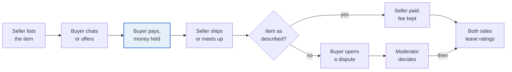
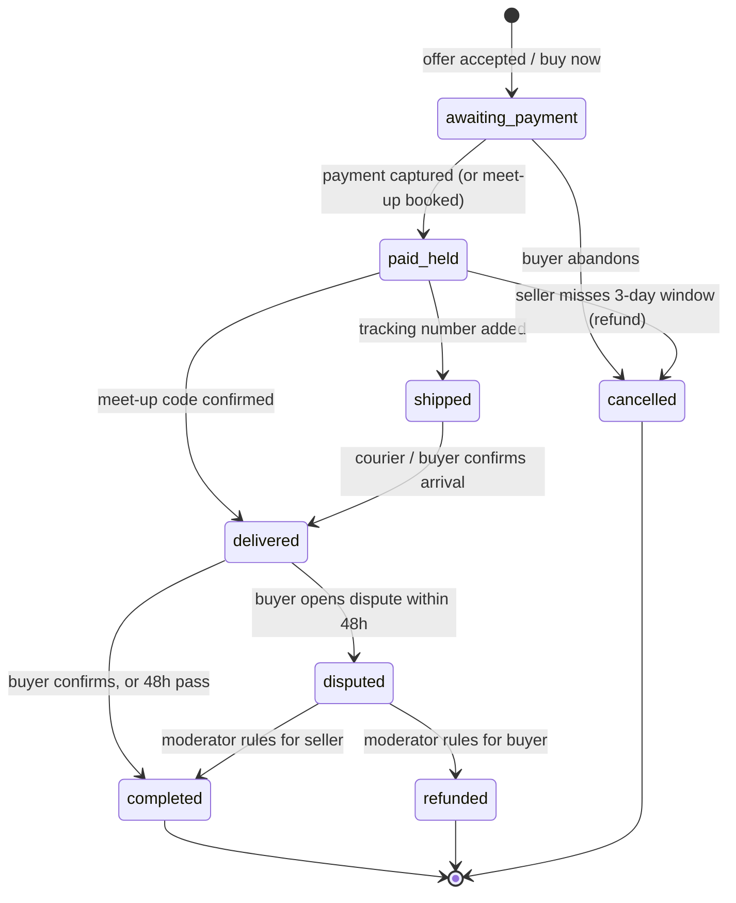
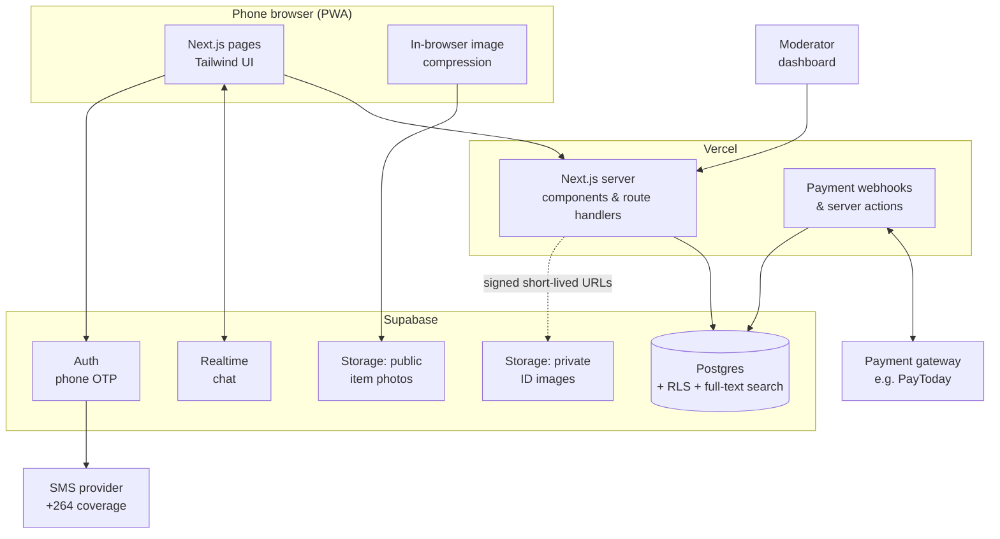
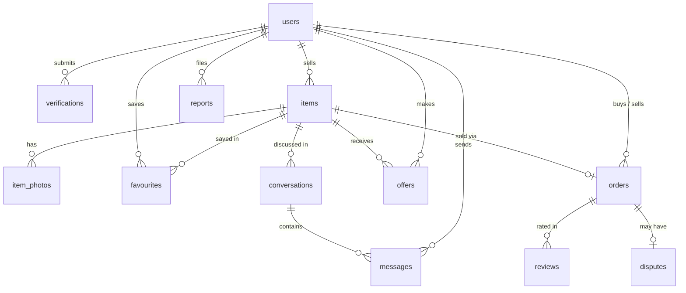
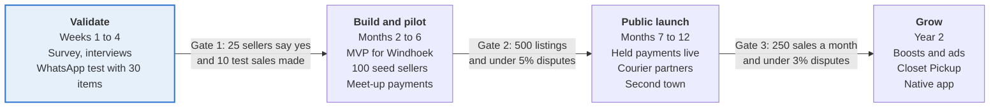

# Rehang

> **Clear your closet. Earn from it.** · *Hang it again.*

Rehang is a mobile-first marketplace where Namibians list clothes from their closets, verified buyers pay safely, and both sides are protected. It starts in Windhoek and grows town by town.

The name comes from the hanger: a garment is "hung again" and gets a second life with someone new.

| | |
|---|---|
| **Status** | Phase 0: Validate (no code yet) |
| **Plan date** | 29 September 2026 |
| **Owner** | Phellep Shapopi |
| **Launch market** | Windhoek, Namibia |
| **Planned stack** | Next.js (PWA) + Tailwind CSS + Supabase, hosted on Vercel |

> [!NOTE]
> This README is the working project plan. Costs, fees and targets in it are **planning assumptions to test, not market facts**. The legal section is a checklist of things to confirm, **not legal advice**.

---

## Contents

1. [Vision and positioning](#1-vision-and-positioning)
2. [Market and competitors](#2-market-and-competitors)
3. [Users and their problems](#3-users-and-their-problems)
4. [Product scope](#4-product-scope)
5. [Trust and verification](#5-trust-and-verification)
6. [Payments and delivery](#6-payments-and-delivery)
7. [How a sale works](#7-how-a-sale-works)
8. [Technology](#8-technology)
9. [Build plan](#9-build-plan)
10. [Roadmap and phase gates](#10-roadmap-and-phase-gates)
11. [Launch and growth plan](#11-launch-and-growth-plan)
12. [Revenue model and budget](#12-revenue-model-and-budget)
13. [Legal and privacy](#13-legal-and-privacy)
14. [Operations and team](#14-operations-and-team)
15. [Risks and mitigations](#15-risks-and-mitigations)
16. [Success metrics](#16-success-metrics)
17. [Next 30 days](#17-next-30-days)
18. [Go or no-go checks](#18-go-or-no-go-checks)
19. [Open decisions](#19-open-decisions)
20. [Where to pick up next](#20-where-to-pick-up-next)
21. [Sources](#21-sources)

---

## 1. Vision and positioning

Rehang is the Vinted and Depop of Namibia: a fashion-only, verified marketplace where anyone can clear their closet and earn from it.

- **Mission:** make it safe, quick and free to list unused clothes, and make buying preloved as trusted as buying from a shop.
- **Promise to sellers:** list in under two minutes, get paid safely, never deal with scammers.
- **Promise to buyers:** every seller is verified, every item has honest photos, and your money is held until the item arrives.

### How Rehang differs from what people use now

| | Facebook groups and Marketplace | Vinted and Depop (the model) | **Rehang** |
|---|---|---|---|
| Built for fashion | No | Yes | **Yes** |
| Verified sellers | No | Partly | **Yes, ID plus selfie** |
| Buyer payment protection | No | Yes | **Yes, money held until confirmed** |
| Filters by size, brand, condition | Weak | Strong | **Strong** |
| Built for Namibian towns, N$, local delivery | Partly | No | **Yes** |
| Cost to list | Free | Free or low | **Free** |

### What we copy and what we change

- **Copy:** the clean photo-first feed, seller shops, favourites, ratings, in-app chat and buyer protection.
- **Change:** add a closet clear-out mode (add many items fast), local meet-up points, mobile money or EFT payments, and low-data image handling, because data is expensive for many users.
- **Keep simple:** one country and one language (English) at launch, with room for Oshiwambo and Afrikaans terms later.

---

## 2. Market and competitors

A search on 29 September 2026 found no dedicated, verified, peer-to-peer fashion marketplace in Namibia, so the gap looks open. The real competitor is habit: Facebook and WhatsApp.

| Player | What it is | Weakness Rehang can use |
|---|---|---|
| Facebook Marketplace (Windhoek) | General listings with an Apparel category | No verification, no payment protection, fashion buried among cars and phones |
| Second Hand Clothing Namibia (Facebook group) | Community group for used clothes | Posts get lost, hard to search by size or price, scam risk |
| @nam_thrift_shop (Instagram) | Windhoek thrift seller with a N$40 delivery fee | One seller's stock only, orders by direct message |
| Kalahari Deals | Free general classifieds site | Everything mixed together, not fashion-led |
| The Red Shelf | Curated thrift and consignment shops in Windhoek and Swakopmund, plus an online shop | A shop you consign to, not a place where anyone lists their own items |
| Used-clothing bale importers | Wholesale bales | Different market (business to business) |

Regional and global models to learn from: **Yaga** (South Africa), **Vinted** and **Depop**.

### Reading of the gap

1. People already sell clothes online here, so the behaviour exists.
2. The pain is trust, search and safe payment, not demand.
3. Vinted grew by solving exactly those three things, so the playbook is proven.

> [!IMPORTANT]
> This was a web search, not a full market study. Validate with real users in Phase 0 (see [Next 30 days](#17-next-30-days)).

---

## 3. Users and their problems

Rehang serves three kinds of seller and two kinds of buyer. Each has a different first reason to open the app.

| User | Example | Main problem today | What Rehang gives them |
|---|---|---|---|
| **Closet clearer** | Thandi, 27, has 40 items she no longer wears | Posting each item in Facebook groups takes hours, and strangers waste her time | Bulk upload, a shareable shop link, safe payment |
| **Returns seller** | Selma ordered five dresses online, three do not fit | Return windows are short, or returns are not possible across the border | A quick way to resell with the tags still on |
| **Side-hustle reseller** | Ndapewa buys bales and sells on Instagram | Manual orders, chasing payment | A storefront, order tracking, ratings that build her name |
| **Budget buyer** | A student needing work clothes | Cannot tell if a seller is real | Verified sellers, honest photos, money held until delivery |
| **Style buyer** | Someone hunting brands or vintage | Endless scrolling in groups | Filters for size, brand, condition, town and price |

**Seller jobs to be done**

- "Help me list ten things while watching TV."
- "Tell me what price is fair."
- "Make sure I actually get paid."

**Buyer jobs to be done**

- "Show me things in my size, near me, that I can trust."
- "Let me pay without fear of being scammed."
- "Let me return or dispute if the item is not as described."

The **returns seller** is a special segment. Give them an **"Unworn, tags on"** badge so buyers can find new items at a discount.

---

## 4. Product scope

The MVP does five things well: **sign up and verify, list fast, browse and filter, chat and buy, and rate each other.** Everything else waits.

### MVP (Phase 1)

| Area | Feature | Detail and example |
|---|---|---|
| Accounts | Phone number login with one-time code | Namibian numbers first (+264), no password to forget |
| Accounts | Profile and shop page | Photo, town, bio, shareable link such as `rehang.com.na/thandi` |
| Listing | Guided photo flow | Prompts for front, back, label, flaw. Blocks blurry or stock images |
| Listing | Item details | Category, size, brand, condition, colour, price in N$, town |
| Listing | Closet clear-out mode | Add many items in a row, save as drafts, publish together |
| Discovery | Feed and search | Filters for size, brand, condition, price and town |
| Discovery | Favourites and follow seller | Alerts when a followed seller lists something new |
| Buying | In-app chat and offers | Buyer makes an offer, seller accepts or counters |
| Buying | Checkout with held payment | Money released after the buyer confirms delivery |
| Trust | Ratings and reviews | Both sides rate after each order |
| Trust | Report and block | One tap on any listing, user or message |
| Admin | Moderation dashboard | Review reports, approve ID checks, freeze accounts |

### Phase 2 additions

- Bundle discounts (buy three items from one seller, save 10 percent).
- Price suggestions from similar sold items.
- "Unworn, tags on" and "Brand verified" badges.
- Push notifications and WhatsApp order updates.
- Courier integration and pick-up lockers or partner shops.
- Seller stats: views, saves, sales.

### Phase 3 additions

- AI listing helper: suggests title, category, colour and price from photos.
- Closet Pickup: Rehang collects, photographs and lists items for busy sellers.
- Charity donation for unsold items.
- Native mobile app (iOS and Android) if the web app proves demand.
- Small business shops for boutiques.

### Deliberately left out at the start

- Non-fashion items (phones, cars). Stay focused so the feed feels curated.
- Auctions and live selling.
- A wallet with stored balances. Pay out to bank or mobile money instead.

---

## 5. Trust and verification

Trust is the product. Rehang uses three layers: **verify the person, verify the item, and protect the money.**

### Layer 1: verify the person

| Level | How | Unlocks |
|---|---|---|
| Level 0 | Phone number and one-time code | Browse, favourite, message |
| Level 1 | Email plus profile photo | Buy items under a set limit |
| Level 2 | Namibian ID or passport photo plus a live selfie match | Sell, and buy without limits |
| Trusted seller | 10 completed sales, rating 4.5 or higher, no upheld disputes | Badge, higher payout limits, priority in search |

Notes on ID checks:

- Start with **manual review** by the founder or a moderator (about 2 minutes each). It is cheaper and safe at low volume.
- Later, use an identity-check provider once volume grows. **Confirm which providers support Namibian IDs** before committing.
- Store the ID image in a **private, encrypted bucket**. Delete it after verification if the law allows, and keep only a "verified" flag and the date.

### Layer 2: verify the item

- **Photo rules:** real photos only, the care label visible, flaws shown, no watermarks from other sites.
- **Automatic checks:** image blur, duplicate photos across accounts (a common scam sign), and text in photos showing phone numbers (to stop off-platform deals).
- **Brand check for high-value items** (for example over N$1,500): the seller uploads label, stitching and serial photos, and a moderator compares them with known patterns. Rehang does not guarantee authenticity at first. It labels the item **"Photos reviewed"** until a proper authentication partner exists.
- **Prohibited list:** counterfeit goods, stolen goods, items with no clear photos, and used underwear and swimwear unless sealed and hygienic (policy still to decide, see [Open decisions](#19-open-decisions)).

### Layer 3: protect the money

- Payment is held by a payment partner until the buyer confirms the item matches the listing, or until 48 hours after confirmed delivery.
- **Dispute window:** 48 hours after delivery. The buyer uploads photos, the seller responds, a moderator decides.
- **Refunds cover:** item not as described, wrong item, or never arrived. **Not covered:** change of mind.

### Scam patterns to block from day one

- Asking to pay outside the app, or moving to WhatsApp before payment.
- New accounts with many high-priced designer items.
- The same photos used by different accounts.
- A seller pushing for a "deposit" or "delivery fee" upfront.

---

## 6. Payments and delivery

Start with a simple, low-risk payment model at launch, and add held-payment checkout once a licensed partner is confirmed.

> [!WARNING]
> Holding other people's money can be regulated in Namibia. This is the most important thing to check early, with the Bank of Namibia or a Namibian lawyer.

### Payment options seen in Namibia

Public sources list PayToday (a Nedbank-backed gateway with a plug-in for online shops), FNB eWallet, MTC AwehPay, Mobipay and standard EFT.

### Recommended approach by phase

| Phase | Payment model | Why |
|---|---|---|
| Phase 0 and early Phase 1 | Pay on meet-up (cash or instant transfer), with a meet-up code in the app | Rehang handles no money, no licence risk, fast to launch |
| Late Phase 1 | Buyer pays through a gateway partner, funds held, released on confirmation | Vinted-style buyer protection |
| Phase 2 | Split payments: platform fee kept automatically, seller paid out to bank or wallet | Automatic commission |

### Questions to ask a payment partner

1. Do you support marketplace or split payments, with payouts to sellers?
2. Can funds be held for up to 7 days before release?
3. Which wallets, cards and EFT methods are supported?
4. What are the transaction fees, monthly fees and dispute handling?
5. Does Rehang need its own payment licence, or can the partner carry it?

### Delivery options

| Option | Best for | Notes |
|---|---|---|
| Safe meet-up points | Same-town sales in Windhoek | Suggest malls or petrol stations with cameras, daytime only. A meet-up code confirms the handover |
| Local courier | Same-town or town-to-town | Buyer pays the delivery fee. Seller drops the parcel off or the courier collects |
| Postal service | Cheaper long-distance | Slow. Needs a tracking number entered in the app |
| Drop-off partner shops | Phase 2 | A few shops act as drop and collect points and earn a small fee |

### Delivery rules

- The seller ships within **3 days** of payment.
- A **tracking number or meet-up code** is required to release money.
- The buyer has **48 hours** after delivery to confirm or open a dispute.
- Packaging tips shown in the app: fold clean, plastic bag, label with the order number.

---

## 7. How a sale works

A sale takes eight steps, and Rehang holds the buyer's money until the item is confirmed. The highlighted step is the trust step.



### Rules that make the flow work

- The seller has 3 days to ship or meet up after payment.
- The buyer has 48 hours after delivery to confirm or open a dispute.
- A dispute needs photos from the buyer and a reply from the seller.
- Money is released automatically if the buyer does nothing after the window closes.
- In the early phase without in-app payments, the same flow runs with a **meet-up code** instead of held money.

### Proposed order states (for implementation)

This state machine follows from the rules above and is what the `orders.status` column should encode. It is a starting design, not part of the original plan.



---

## 8. Technology

Build a **mobile-first web app (PWA) on Next.js and Supabase** first. It is the fastest route to a working product with one developer, and it can be wrapped as a phone app later.

### Recommended stack

| Layer | Choice | Why |
|---|---|---|
| Front end | Next.js (React) with Tailwind CSS, installable as a PWA | One codebase, fast, works on any phone browser, no app store wait |
| Back end and database | Supabase (Postgres, Auth, Storage, Row Level Security) | Login, database, image storage and access rules in one place |
| Phone login | One-time codes by SMS through a provider that covers Namibia | Simple sign-up, no passwords |
| Images | Compress in the browser before upload, store several sizes | Saves data for users and storage cost |
| Search | Postgres full-text search and filters first | Enough for thousands of listings. Add a search service later |
| Payments | Gateway partner via server-side functions | Keeps secret keys off the browser |
| Hosting | Vercel | Simple deploys and preview links |
| Admin | Internal dashboard page for moderators | Approve IDs, handle reports and disputes |
| Monitoring | Error tracking and product analytics (page views, listing funnel) | Know where users drop off |

### Architecture overview



### Core data model (first version)

| Table | Key fields |
|---|---|
| `users` | id, phone, name, town, photo, verification_level, created_at |
| `verifications` | user_id, type, status, reviewed_by, reviewed_at (ID image kept in a private bucket) |
| `items` | id, seller_id, title, category, size, brand, condition, price, town, status, created_at |
| `item_photos` | item_id, url, position |
| `favourites` | user_id, item_id |
| `conversations` and `messages` | participants, item_id, body, created_at |
| `offers` | item_id, buyer_id, amount, status |
| `orders` | id, item_id, buyer_id, seller_id, amount, fee, status, delivery_method, code |
| `reviews` | order_id, reviewer_id, rating, comment |
| `reports` | reporter_id, target_type, target_id, reason, status |
| `disputes` | order_id, opened_by, reason, evidence, decision |



Implementation notes to carry into the first migration:

- Store money as **integer cents** (`price_cents`, `fee_cents`) in N$ to avoid rounding errors.
- Use Postgres enums or check constraints for `condition`, `items.status` (draft, active, reserved, sold, removed), `orders.status` (see the state machine above) and `verification_level`.
- Add a `follows` table (follower_id, seller_id) for "follow seller" alerts, which the MVP needs but the first data model does not list.
- Add a `blocks` table (blocker_id, blocked_id) for report-and-block.
- Add a `tsvector` column on `items` (title, brand, category) with a GIN index for search.

### Security basics

- **Row Level Security on every table**, so users see only what they should.
- ID images in a **private bucket** with short-lived access links, visible only to moderators.
- **Rate limits** on sign-up, messages and listing creation.
- **Never store card details.** The payment partner handles them.
- Hide phone numbers in chat and flag messages that contain them.

### Proposed repository layout

Nothing is scaffolded yet. When Phase 1 starts, aim for something like:

```text
rehang/
├── app/                    # Next.js App Router
│   ├── (auth)/             # login, OTP, onboarding
│   ├── (shop)/             # feed, search, item page, seller shop [handle]
│   ├── sell/               # guided photo flow, closet clear-out mode
│   ├── inbox/              # chat and offers
│   ├── orders/             # checkout, meet-up code, confirm, dispute
│   ├── admin/              # moderation dashboard (role-gated)
│   └── api/                # webhooks (payments, SMS)
├── components/             # shared UI
├── lib/
│   ├── supabase/           # server and browser clients
│   ├── images/             # compression and resizing
│   └── validation/         # zod schemas for forms
├── supabase/
│   ├── migrations/         # SQL schema, RLS policies
│   └── seed.sql            # sample towns, categories, sizes
├── public/                 # PWA manifest, icons
└── docs/                   # policies, moderator guide, survey
```

### Local development

To be written when the repository is scaffolded (Week 4 of the next 30 days, if the go/no-go check passes). Expected prerequisites: Node.js LTS, the Supabase CLI and a Vercel account.

---

## 9. Build plan

### Effort estimate (one developer)

| Block | Estimate |
|---|---|
| Design, wireframes and branding | 1 to 2 weeks |
| Accounts, verification, profiles | 2 weeks |
| Listings, photo upload, feed, filters | 3 weeks |
| Chat, offers, favourites, notifications | 2 weeks |
| Orders, payments, delivery codes, reviews | 3 weeks |
| Admin dashboard, reports, disputes | 2 weeks |
| Testing, fixes, launch prep | 2 weeks |
| **Total** | **about 15 to 16 weeks of focused work** |

Working part-time alongside a job and studies, plan for **6 to 8 months**, or shrink the MVP (drop in-app payments at first and use meet-up codes) to launch in about **10 weeks**.

### Milestones and task checklist

Each milestone should end with something usable on a phone.

**M0: Foundations**
- [ ] Create the Next.js app with TypeScript, Tailwind CSS and ESLint
- [ ] Create the Supabase project (dev and prod) and link the CLI
- [ ] Connect Vercel with preview deploys per branch
- [ ] PWA manifest, icons, brand colours
- [ ] Error tracking and analytics wired in

**M1: Accounts and verification**
- [ ] Phone OTP login (+264), with an SMS provider confirmed for Namibia
- [ ] Onboarding: name, town, photo (Level 1 adds email)
- [ ] Profile and public shop page at `/[handle]`
- [ ] ID plus selfie upload to a private bucket (Level 2)
- [ ] `verification_level` gating in RLS and in the UI

**M2: Listings and discovery**
- [ ] Guided photo flow (front, back, label, flaw) with in-browser compression and several sizes
- [ ] Blur check and duplicate-photo check
- [ ] Item details form (category, size, brand, condition, colour, price, town)
- [ ] Closet clear-out mode: batch drafts, publish together
- [ ] Feed, full-text search and filters (size, brand, condition, price, town)
- [ ] Favourites and follow seller

**M3: Chat and offers**
- [ ] Realtime chat per item
- [ ] Phone-number detection and off-app warnings
- [ ] Offers: make, accept, counter, decline
- [ ] New-listing alerts for followers

**M4: Orders and delivery**
- [ ] Order creation from an accepted offer or buy-now
- [ ] Meet-up code flow (launch default, no money handled)
- [ ] Tracking-number entry for courier or post
- [ ] Timers: 3-day ship window, 48-hour confirm window, auto-complete
- [ ] Reviews from both sides after completion
- [ ] *(Late Phase 1)* Gateway checkout with held funds, behind a feature flag so the checkout stays modular

**M5: Trust and moderation**
- [ ] Report and block on listings, users and messages
- [ ] Admin dashboard: ID queue, report queue, dispute queue, freeze accounts
- [ ] Dispute flow: buyer evidence, seller reply, moderator decision
- [ ] Scam signals: new account with many high-priced items, reused photos

**M6: Launch prep**
- [ ] Terms of use, privacy policy, seller rules, prohibited items pages
- [ ] Security checklist (RLS audit, bucket permissions, rate limits)
- [ ] Load 500 founding-seller listings
- [ ] Invite-only waiting list and invite codes

---

## 10. Roadmap and phase gates

Rehang moves through four phases. Each gate is a set of numbers to reach before spending more time or money. **If a gate is missed, adjust or stop instead of pushing on.**



The shaded phase is where the project is now. Timings assume part-time work alongside a job and studies, and can shrink with a co-builder.

| Phase | Main outputs | Who it is for |
|---|---|---|
| Validate | Survey results, interview notes, 30 test items sold through WhatsApp, chosen name and domain | The founder and the first 10 founding sellers |
| Build and pilot | Working web app: sign-up, verification, listings, chat, offers, meet-up codes, admin dashboard | 100 seed sellers and a small invited group of buyers |
| Public launch | Held payments, courier options, reviews and disputes, second town (Swakopmund or Walvis Bay) | Open to the public, still in English |
| Grow | Boosts, ads, Closet Pickup, native app, more towns | Wider Namibia |

---

## 11. Launch and growth plan

Solve the chicken-and-egg problem by **launching supply first**: recruit 100 sellers with full closets in Windhoek before opening to buyers. Buyers follow good stock.

### Step 1: Seed the supply (weeks 1 to 6)

- Recruit 30 **founding sellers** personally: friends, colleagues, university students, fashion Instagram pages, thrift sellers already on Instagram.
- Offer a **"closet party"**: photograph and list their items with them.
- Reward: "Founding Seller" badge, top placement in the feed for 3 months, and zero commission for the first 6 months.
- Target: **500 quality listings** before the public launch.

### Step 2: Invite buyers (weeks 6 to 10)

- Invite-only launch with a waiting list. It feels exclusive and lets problems be fixed at small numbers.
- Share individual seller shop links in WhatsApp status, Facebook groups and Instagram.
- Partner with campus groups at **NUST and UNAM**, and with young professionals' groups.

### Step 3: Public launch and growth (months 3 to 6)

| Channel | Tactic | Example |
|---|---|---|
| Instagram and TikTok | Short videos: "Closet clear-out with me", "N$100 thrift haul", styling videos | Weekly posts, three creators paid in store credit |
| WhatsApp | Share buttons on every listing and shop | "Check my closet on Rehang" link |
| Events | Pop-up swap and sell days | A Saturday market stall where people list on the spot |
| Referrals | Invite a friend, both get a small credit or a boosted listing | Credit used against delivery fees |
| Community | Themed drops: back to school, graduation wear, wedding season, winter coats | Campaign pages in the app |
| Partnerships | Local designers and tailors offering alterations | Discount for Rehang sellers |

### Messages that work for Namibia

- **Save money:** "Quality clothes for less."
- **Earn money:** "Your closet is worth more than you think."
- **Safe:** "Verified sellers only."
- **Sustainable:** "Give clothes a second life."

### Brand basics to prepare

- Logo with a hanger mark, a simple colour palette, and a clear voice: friendly, honest, local.
- Domain (for example a `.com.na` name), social handles (`@rehang.na`), and a one-page landing site with the waiting list.

### Growth rules

1. Do not expand to a new town until the current town has **at least 1 completed sale per 5 active listings each month**.
2. Order of expansion: **Windhoek → Swakopmund and Walvis Bay → Oshakati and Ongwediva → other towns.**
3. Keep everyone talking inside the app. Sellers who take buyers to WhatsApp before payment are warned.

---

## 12. Revenue model and budget

Listing stays free. Rehang earns a small fee only when a sale completes, so sellers pay nothing until they are paid.

### Revenue streams

| Stream | How it works | When |
|---|---|---|
| Seller commission | 5 to 8 percent of the item price on completed in-app sales, minimum N$5 | From the first paid checkout |
| Buyer protection fee | Small fixed fee, for example N$5 per order, covers dispute handling | Phase 2 |
| Boosts | Seller pays N$10 to N$30 to push a listing to the top for 3 days | Phase 2 |
| Closet Pickup | Service fee to collect, photograph and list items (N$100 plus a share of sales) | Phase 3 |
| Brand and shop ads | Local shops, tailors and salons pay for banners or featured shops | Phase 3, after real traffic |
| Founding sellers | Zero commission for 6 months (a cost, not income) | Launch |

### Worked example of the unit economics

Suppose the average item sells for **N$180** and the commission is **8 percent**.

- Rehang earns **N$14.40 per sale**.
- If the payment partner charges around 3 percent, pass that cost to the buyer or include it in the fee so it does not eat the margin.
- At 1,000 sales a month, sales value is N$180,000 and commission is about **N$14,400**.

### Monthly running cost (at about 1,000 sales a month)

| Cost | Estimate per month |
|---|---|
| Hosting, database and storage | N$1,500 |
| SMS codes and email | N$1,000 |
| Part-time moderator and support | N$4,000 |
| Marketing and creators | N$5,000 |
| **Total** | **N$11,500** |

**Break-even is roughly 800 sales a month** (N$11,500 ÷ N$14.40). Below that, the project is funded by the founder, a grant or a small investor.

### Start-up budget for the first 6 months (rough)

| Item | Estimate |
|---|---|
| Company registration and name reservation | Confirm current fees with BIPA |
| Domain and email | About N$500 |
| Branding and logo | N$0 to N$3,000 (DIY or student designer) |
| Cloud and SMS during build and pilot | About N$1,500 to N$3,000 |
| Launch events and creator credits | N$3,000 to N$6,000 |
| Legal review of terms and privacy policy | Get a quote |

A lean start of roughly **N$10,000 to N$20,000** is realistic when self-built. Time is the biggest cost.

### Funding ideas

- Self-funded MVP, then a pitch with real numbers.
- Local incubators and youth business programmes (ask NUST contacts about incubation options).
- Small angel investors once there are 500 or more active users.

### Why not charge to list?

Free listing fills the feed quickly, and an empty feed is the biggest problem. Commission on success matches Rehang's income to the seller's income.

---

## 13. Legal and privacy

Register a company, publish clear terms and a privacy policy, and get a Namibian lawyer to confirm the payment and data rules **before taking real money or ID documents**.

| Topic | What to do | Why it matters |
|---|---|---|
| Business registration | Register the company and trade name with BIPA (Business and Intellectual Property Authority) | Needed for bank accounts, payment partners and contracts |
| Trademark | Search and file for "Rehang" and the logo | Protects the brand before spending on marketing |
| Tax | Register with the tax authority when required and check VAT rules | Commission income is business income |
| Payments | Confirm with a lawyer or the Bank of Namibia whether holding buyer funds needs a licence, or whether a licensed partner can hold them | The biggest regulatory risk in the plan |
| Data protection | Collect only what is needed, explain why, get consent, secure it. Check the current status of Namibian data protection law | Rehang will hold phone numbers, photos and ID images |
| Electronic transactions | Terms of use accepted at sign-up, with clear records of consent | Makes the agreement with users enforceable |
| Consumer protection | Clear returns and dispute rules, honest descriptions required from sellers | Protects buyers and Rehang from claims |
| Intermediary role | Terms say Rehang is a platform between users, and explain takedown steps for illegal or stolen goods | Limits liability for what users sell |
| Anti-money-laundering | Ask a lawyer whether identity checks and payment flows trigger reporting duties | Payment platforms are often covered |

### Documents to prepare

1. Terms of use.
2. Privacy policy in plain language, including how long ID images are kept.
3. Seller rules: what may be sold, honest photos, shipping times.
4. Buyer protection and dispute policy.
5. Prohibited items list: counterfeits, stolen goods, weapons, anything unsafe.
6. Moderator guidelines for verification and disputes.

---

## 14. Operations and team

At launch, the founder runs product, verification and support with one or two part-time helpers. **Hire a moderator when reports pass about 20 a day.**

### Roles

| Role | Phase 1 | Later |
|---|---|---|
| Founder and product owner | Product, code, partnerships | Product and strategy |
| Community and moderation lead | Part-time helper: reviews IDs, reports and disputes | Full-time, with a small team |
| Designer | Freelance or student for brand and app screens | Contract as needed |
| Growth and content | Creators paid in store credit, one campus ambassador | Marketing hire |
| Legal and accounting | Outsourced | Outsourced |

### Routine

- **Daily:** review new ID checks (aim within 24 hours), open reports, open disputes, listing quality spot checks.
- **Weekly:** review metrics, message top sellers, feature a "seller of the week", clean up drafts and spam.
- **Monthly:** payout reconciliation, policy review, user survey.

### Service standards

| Task | Target response |
|---|---|
| ID verification | Within 24 hours |
| Report on a listing or user | Within 12 hours |
| Dispute decision | Within 3 working days |
| Support message | Within 1 working day |

**Support channels:** start with WhatsApp Business and email. Add an in-app help centre once the same questions repeat.

---

## 15. Risks and mitigations

The biggest risks are too few listings, scams that damage trust, and payment rules. Rows are sorted from most to least serious.

| Risk | What could happen | Mitigation |
|---|---|---|
| Too few listings and buyers (the empty marketplace) | Visitors see little, leave and never return | Seed 500 listings before launch, one town only, founding-seller rewards, invite-only start |
| Scams and fake items | One bad story spreads in WhatsApp groups and kills trust | Verified sellers, held payments, dispute process, fast takedown, visible reporting |
| Payment licence or partner problems | Cannot hold funds, launch delayed | Start with meet-up payments, speak to partners and a lawyer in week 1, keep the checkout modular |
| People trade off the app to avoid fees | Lost revenue and no buyer protection | Hide phone numbers in chat, warn about off-app deals, keep fees small, add value (protection, shipping, reviews) |
| Delivery is unreliable or expensive | Buyers cancel, disputes rise | Focus on same-town meet-ups first, pick one or two courier partners, clear delivery rules |
| Facebook and WhatsApp habits are strong | Users try Rehang once and go back | Make listing faster than posting on Facebook, shareable shop links, features Facebook lacks (filters, verification) |
| Data breach of ID images | Legal and reputation damage | Private encrypted storage, restricted access, delete after review, security checklist before launch |
| Founder overload (job, degree and project) | Slow progress, burnout | Small MVP, part-time helper, fixed weekly build hours, drop nice-to-haves |
| Copies from bigger players | A larger platform enters Namibia | Move fast locally, own the community, partner with local brands and couriers |
| Counterfeit branded goods | Buyers feel cheated | "Photos reviewed" labels, high-value item checks, clear disclaimers, ban repeat offenders |

### Early warning signs to watch

- Fewer than 3 new listings per active seller in the first month.
- More than 5 percent of orders disputed.
- Sellers asking for WhatsApp numbers in the first message.
- Verification queue older than 48 hours.

---

## 16. Success metrics

Track supply, demand and trust together. A marketplace only works when all three grow. Targets are starting guesses for Windhoek, to be revised after the pilot. Months count from public launch.

| Metric | Month 3 | Month 6 | Month 12 |
|---|---|---|---|
| Verified sellers | 100 | 400 | 1,500 |
| Active listings | 500 | 2,500 | 10,000 |
| Registered buyers | 300 | 1,500 | 6,000 |
| Completed sales per month | 30 | 250 | 1,000 |
| Share of listings that sell within 30 days | 10% | 15% | 20% |
| Disputes as share of orders | under 5% | under 3% | under 2% |
| Average seller rating | 4.5 | 4.6 | 4.7 |
| Verification time (median) | under 24 hours | under 12 hours | under 12 hours |
| Towns live | 1 | 2 | 4 |

### Key funnels to measure

1. **Seller funnel:** sign up → verified → first listing → first sale. Watch where people stop.
2. **Buyer funnel:** visit → view item → message or offer → pay → confirm delivery.
3. **Return rate:** buyers who buy a second time within 60 days.

### North-star metric

**Completed, undisputed sales per week.** It captures listings, buyers and trust in one number.

---

## 17. Next 30 days

Spend the first month proving demand and settling the name, payments and legal questions, **before writing much code**.

### Week 1 (30 September to 6 October 2026)

- [ ] Confirm the name Rehang: check the domain, social handles and a BIPA name search
- [ ] Write the 10-question survey for sellers and buyers
- [ ] Send the survey to 50 people (friends, colleagues, campus groups, Facebook groups)
- [ ] Create the Instagram page and a simple waiting-list page
- [ ] Ask one Namibian lawyer or advisor about payment holding and data protection

### Week 2 (7 to 13 October 2026)

- [ ] Interview 10 people who sell clothes online now. Ask what they hate about it
- [ ] Recruit 10 founding sellers and list their items by hand on a shared spreadsheet or Instagram
- [ ] Contact PayToday and one bank about marketplace payments and fees
- [ ] Sketch the listing flow and the item page on paper or in a design tool

### Week 3 (14 to 20 October 2026)

- [ ] Run a mini test: a WhatsApp community with 30 items. Count messages, offers and sales
- [ ] Note every scam attempt and every question buyers ask. These become the FAQ and rules
- [ ] Choose the MVP scope: with or without in-app payments for the first release
- [ ] Draft the brand basics: logo idea, colours, tone of voice

### Week 4 (21 to 27 October 2026)

- [ ] Decide: go, adjust or stop, using the checks below
- [ ] If go: set up the repository, database and login, and start building Phase 1 (milestone M0)
- [ ] Book two courier and meet-up partner conversations
- [ ] Prepare a one-page pitch with survey results for incubator or funding conversations

---

## 18. Go or no-go checks

After the first 4 weeks, all of these should be green before starting Phase 1.

| Check | Green light |
|---|---|
| Sellers | At least 25 people say they would list, and 10 actually hand over photos |
| Buyers | At least 30 people say they would buy from verified sellers |
| Test sales | At least 10 completed sales from the WhatsApp test |
| Payments | One partner can support held or split payments, or a clear plan for meet-up payments exists |
| Time | Fixed weekly hours can be committed alongside job and studies |

---

## 19. Open decisions

Decisions the plan leaves open. Record the answer and the date here when each is made.

| Decision | Options | Needed by | Decision |
|---|---|---|---|
| In-app payments in the first release? | Meet-up codes only (about 10-week MVP) / gateway with held funds (about 16 weeks) | Week 3 | |
| Payment partner | PayToday / a bank / other | Before late Phase 1 | |
| Payment licence | Rehang licensed / partner carries it | Before taking any money | |
| SMS provider for OTP | Must cover +264 numbers | M1 | |
| ID verification | Manual review / provider that supports Namibian IDs | M1 (manual to start) | |
| ID image retention | Delete after review / keep for a set period | Before collecting IDs | |
| Hygiene items (underwear, swimwear) | Allow only if new or sealed / ban | Before launch | |
| Minimum seller age | 18+ only / under-18 with parent account | Before launch | |
| Police and stolen-goods requests | Who receives them and how quickly | Before launch | |
| Commission rate | 5% to 8%, minimum N$5 | Before first paid checkout | |
| Domain | A `.com.na` name, e.g. `rehang.com.na` | Week 1 | |
| Tagline | "Clear your closet. Earn from it." / "Hang it again." | Week 3 (brand basics) | |

---

## 20. Where to pick up next

When coming back to this project:

1. Work through [Next 30 days](#17-next-30-days), ticking boxes in this README as you go.
2. Fill in [Open decisions](#19-open-decisions) as answers come in.
3. At the end of Week 4, run the [go or no-go checks](#18-go-or-no-go-checks).
4. If go, start [milestone M0](#milestones-and-task-checklist): scaffold Next.js and Supabase following the [proposed repository layout](#proposed-repository-layout), then write the Local development section.

---

## 21. Sources

Searched on 29 September 2026. Figures for costs, fees and targets in this plan are planning assumptions, not sourced facts.

- Facebook Marketplace, Windhoek
- Second Hand Clothing Namibia, Facebook group
- @nam_thrift_shop, Instagram
- Kalahari Deals Namibia
- The Red Shelf, Namibia Craft Centre
- Yaga, South Africa
- Vinted, Wikipedia
- PayToday Namibia
- Transfi: common payment methods in Namibia
- PayAtlas: accepting payments in Namibia

---

*The original full plan (PDF) is kept locally and is not tracked in this repository.*
