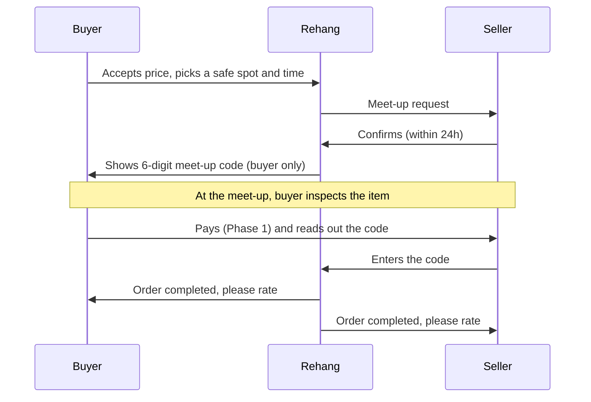

# Orders, meet-ups and delivery

How an order works from offer to rating, including the rules the original plan left open: meet-up codes, cancellations, no-shows, strikes and timers.

## Delivery by phase

| Phase | Delivery methods | Payment |
|---|---|---|
| **Phase 1: Build and pilot** (Windhoek only) | Meet-up only | Buyer pays the seller at the meet-up (cash or instant EFT). Rehang handles no money |
| **Phase 2: Public launch** | Meet-up, local courier, postal service | Held payment through a gateway partner (see [README section 6](../../README.md#6-payments-and-delivery)) |
| **Phase 3: Grow** | Adds drop-off partner shops and pick-up lockers | Split payouts |

Town-to-town sales only open once held payments are live, because shipping without payment protection is where most scams happen.

## Offers and reservations

- A buyer can **buy at the listed price**, or **make an offer**.
- Offers must be at least 60% of the listed price. This stops lowball spam.
- The seller can accept, counter or decline. An offer expires after **24 hours** without a reply.
- Each buyer can have up to 3 open offers per item and 10 open offers in total.
- When an offer is accepted, or the buyer chooses buy now, an **order** is created and the item shows as **Reserved**.

## Meet-up code flow

Rules:
- Only the buyer sees the code, and the buyer only gives it to the seller **after checking the item**. Entering the code confirms the handover. In Phase 2 it also releases the held money.
- The code is valid from 1 hour before the meet-up until 24 hours after.
- After 5 wrong entries the code locks and support is alerted.
- In Phase 1 the buyer inspects the item before paying, so "not as described" disputes should be rare. If the item is wrong, the buyer simply doesn't pay or give the code, and reports the order.

## Safe meet-up spots

Meet-ups can only be booked at approved spots, during **08:00–18:00**.

Criteria for an approved spot: public, CCTV, security guards, easy parking or taxi access, open 7 days. Candidates for Windhoek, to confirm on a visit:
- Maerua Mall
- Grove Mall of Namibia
- Wernhil Park
- Town Square / Post Street Mall area
- Busy petrol station forecourts with shops

Stored in a `meetup_spots` table (name, town, address, opening hours, active). Add spots per town when expanding.

## Timers

| Timer | Length | What happens when it runs out |
|---|---|---|
| Offer reply | 24 hours | Offer expires |
| Seller confirms a meet-up request | 24 hours | Order cancelled automatically, item back on sale, no strike |
| Meet-up must happen | Within 3 days of the order | Order cancelled automatically, and whoever didn't confirm a time gets a strike |
| Seller ships (Phase 2 courier or post) | 3 days after payment | Order cancelled, buyer refunded, seller gets a strike |
| Buyer confirms or disputes after delivery (Phase 2) | 48 hours | Order completes automatically and the seller is paid |
| Rating window | 7 days after completion | Rating option closes |

All timers run as scheduled database jobs (Supabase `pg_cron` or a scheduled function), not in the browser.

## Cancellations

| Who cancels | When | Result |
|---|---|---|
| Buyer | Before the seller confirms | Free |
| Buyer | After the seller confirms | Allowed up to 2 hours before the meet-up. Later than that counts as a no-show |
| Seller | Any time after accepting | Strike, unless the item was damaged or lost and the seller reports it before the meet-up |
| Both agree | Any time | Free. Both tap "cancel by agreement" |

## No-shows

- Either side can tap **"They didn't show"** from 30 minutes after the meet-up time.
- The other side has 24 hours to respond, for example by attaching a photo from the spot or sending a message.
- If there's no response, or it's clearly a no-show, the absent party gets a strike.
- If both sides say the other didn't show, a moderator decides using the chat history.

## Strikes

| Strikes in 90 days | Result |
|---|---|
| 1 | Warning in the app |
| 2 | Warning, and the user can't make new offers or accept orders for 72 hours |
| 3 | Buying and selling suspended for 14 days, then reviewed by a moderator |
| 4+ | Account review. A permanent ban is possible |

Also counts as a strike: pushing a buyer to pay outside the app (Phase 2), or asking for a deposit or delivery fee upfront. Serious fraud skips the ladder and leads to an immediate ban.

## Problems and disputes

**Phase 1 (meet-up only):** "Report a problem with this order" sends the order and chat history to the moderator queue. Examples: item very different from the listing, seller behaving unsafely, fake payment proof.

**Phase 2 (held payments):** the full dispute flow.
1. The buyer opens a dispute within 48 hours of delivery. They pick a reason (not as described / wrong item / not received) and upload at least 2 photos.
2. The seller has 48 hours to respond with a statement and photos.
3. A moderator decides within 3 working days: **refund** (the buyer returns the item at the seller's cost if the seller was at fault), **partial refund**, or **release to the seller**.
4. Both sides can still rate each other.

"Change of mind" is not covered. See the [buyer protection policy](../policies/buyer-protection.md).

## Notifications

| Event | In-app | SMS (Phase 1) | WhatsApp / push (Phase 2) |
|---|---|---|---|
| New message or offer | ✓ | | ✓ |
| Offer accepted, order created | ✓ | ✓ | ✓ |
| Meet-up confirmed / reminder 2 hours before | ✓ | ✓ | ✓ |
| Order completed / rate your trade | ✓ | | ✓ |
| ID approved / rejected | ✓ | ✓ | ✓ |
| Followed seller lists a new item | ✓ (daily digest) | | ✓ |
| Strike or suspension | ✓ | ✓ | ✓ |

SMS costs money, so only send an SMS when missing the message could break an order or someone's access.
